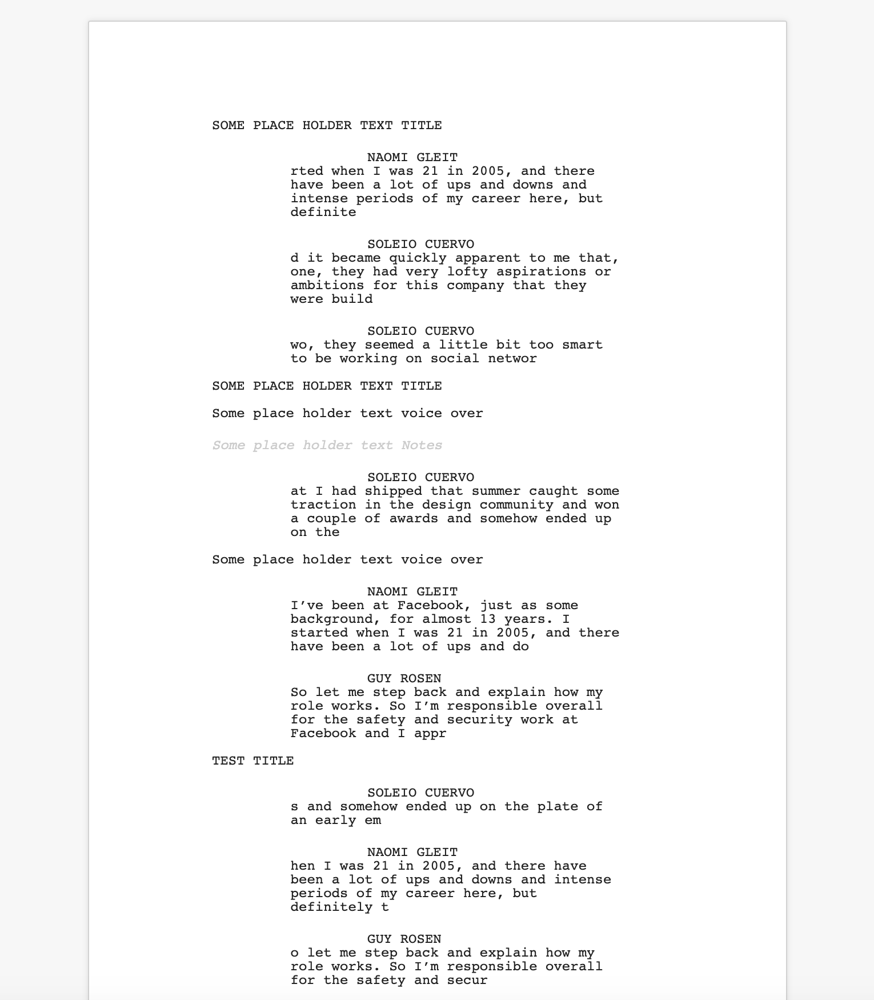

## [DPE](https://github.com/pietrop/digital-paper-edit-client) programme script to fountain script

<!-- _One liner + link to confluence page_
_Screenshot of UI - optional_ -->

_Work in progress_

The 💡 is that the output of [autoEdit 3](https://www.autoedit.io), [programme script](https://autoedit.gitbook.io/autoedit-3-user-manual/paperediting) could be exported as a screenplay script, using [fountain](https://fountain.io/).

> Fountain is a simple markup syntax for writing, editing and sharing screenplays in plain, human-readable text. Fountain allows you to work on your screenplay anywhere, on any computer or tablet, using any software that edits text files.



Code is borrowed and modified from

- [BadIdeaFactory/scriptchat](https://github.com/BadIdeaFactory/scriptchat)
- [thombruce/fountain.js](https://github.com/thombruce/fountain.js/blob/master/fountain.js)
- [brudil/timothy](https://github.com/brudil/timothy)

progress so far

- [x] can convert programme script `json` to `.fountain` text (this can be opened in [Final Draft](https://store.finaldraft.com/all-final-draft-products.html),[beat](https://lmparppei.itch.io/beat)([github](https://github.com/lmparppei/Beat/)), and [other screen writing softwares](https://fountain.io/apps))
- [x] can convert `.fountain` to `html`
- [x] dpe to word `.docx` file that looks formatted like a screen play (does not use fountain tho)
- [ ] ⌛ convert `.fountain` to pdf (see [example pdf output](./public/test.pdf) for progress so far )

## Setup

<!-- _stack - optional_
_How to build and run the code/app_ -->

```
git clone git@github.com:pietrop/dpe-programme-script-to-fountain-script.git
```

```
npm install
```

## Usage

TBC, still work in progress

## System Architecture

<!-- _High level overview of system architecture_ -->

## Documentation

There's a [docs](./docs) folder in this repository.

[docs/notes](./docs/notes) contains dev draft notes on various aspects of the project. This would generally be converted either into ADRs or guides when ready.

[docs/adr](./docs/adr) contains [Architecture Decision Record](https://github.com/joelparkerhenderson/architecture_decision_record).

> An architectural decision record (ADR) is a document that captures an important architectural decision made along with its context and consequences.

We are using [this template for ADR](https://gist.github.com/iaincollins/92923cc2c309c2751aea6f1b34b31d95)

## Development env

 <!-- _How to run the development environment_ -->

- npm > `6.13.4`
- Node >12

Node version is set in node version manager [`.nvmrc`](https://github.com/creationix/nvm#nvmrc)

```
nvm use
```

<!-- _Coding style convention ref optional, eg which linter to use_ -->

<!-- _Linting, github pre-push hook - optional_ -->

## Build

<!-- _How to run build_ -->

_TBC_

## Tests

<!-- _How to carry out tests_ -->

_NA_

## Deployment

<!-- _How to deploy the code/app into test/staging/production_ -->

_TBC_
